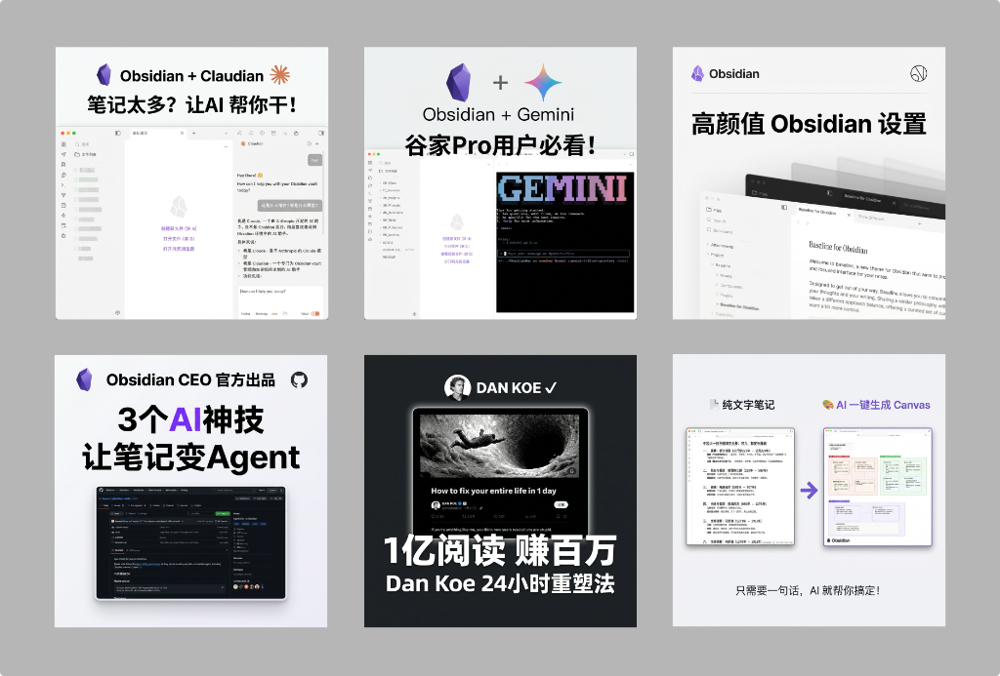

# 📱 XHS Images Generator

> 小红书信息图生成器 - 一键将文章/笔记转换为精美的小红书配图系列

[](https://claude.ai)
[](https://opensource.org/licenses/MIT)
[](https://xhslink.com/m/609DkyTU0pp)

## 🖼️ 效果展示

<p align="center">
  
</p>

<p align="center">
  <i>使用本工具生成的小红书配图示例</i>
</p>

## ✨ 功能特点

- 🎨 **11 种视觉风格** - 从可爱少女风到极简科技风，覆盖各类内容调性
- 📐 **6 种信息布局** - 稀疏、均衡、密集、列表、对比、流程
- 🤖 **智能选择** - 根据内容自动匹配最佳风格和布局
- 📝 **一键生成** - 输入文章，输出 1-10 张精美配图

## 🎨 风格预览

| 风格 | 描述 | 适用场景 |
|------|------|----------|
| `cute` | 甜美可爱少女风 | 美妆、穿搭、生活 |
| `fresh` | 清新自然风 | 健康、养生、自我提升 |
| `tech` | 现代科技风 | AI、工具、技术教程 |
| `notion` | 极简手绘线条 | 知识分享、效率工具 |
| `insight` | 深色高级感 | 思维模型、深度思考 |
| ... | 更多风格 | 详见 SKILL.md |

## 🚀 快速开始

### 前置要求

- [Claude](https://claude.ai) 账号（支持 Claude Code / Cursor 等）
- 安装本 Skill 到你的 Claude 环境

### 基础用法

```bash
# 自动选择风格和布局
/xhs-images posts/my-article.md

# 指定风格
/xhs-images posts/my-article.md --style notion

# 指定布局
/xhs-images posts/my-article.md --layout dense

# 组合使用
/xhs-images posts/my-article.md --style tech --layout list
```

### 直接输入内容

```bash
/xhs-images
[粘贴你的内容]
```

## 📁 项目结构

```
xhs-images/
├── SKILL.md              # 完整使用文档
├── prompts/
│   └── system.md         # 图片生成系统提示词
└── references/
    ├── styles.md         # 11 种风格详细规格
    └── layouts.md        # 6 种布局详细规格
```

## 🎯 工作流程

1. **分析内容** → 理解主题，确定图片数量（2-10张）
2. **生成大纲** → 规划每张图的核心信息和视觉方案
3. **逐张生成** → 调用图像生成模型创建配图
4. **输出报告** → 汇总所有生成的图片

## 📖 示例输出

```
小红书配图系列生成完成！

主题: AI 提升工作效率的 5 个方法
风格: tech
位置: posts/ai-tips/xhs-images/

- 01-cover.png ✓ 封面 (sparse)
- 02-content-1.png ✓ 内容 (list)
- 03-content-2.png ✓ 内容 (balanced)
- 04-ending.png ✓ 结尾 (sparse)

大纲: outline.md
```

## 🤝 贡献

欢迎提交 Issue 和 Pull Request！

## 📄 License

MIT License - 详见 [LICENSE](LICENSE)

---

## 🔥 关注我的小红书

想了解更多 AI + 笔记的玩法技巧？关注我的小红书！

[](https://xhslink.com/m/609DkyTU0pp)

👉 **[点击访问我的小红书主页](https://xhslink.com/m/609DkyTU0pp)** 👈

分享内容包括：
- 🤖 AI 工具使用技巧
- 📝 Obsidian 笔记管理
- 🎨 效率工具推荐
- 💡 个人知识管理

---

**Made with ❤️ for 小红书创作者**
